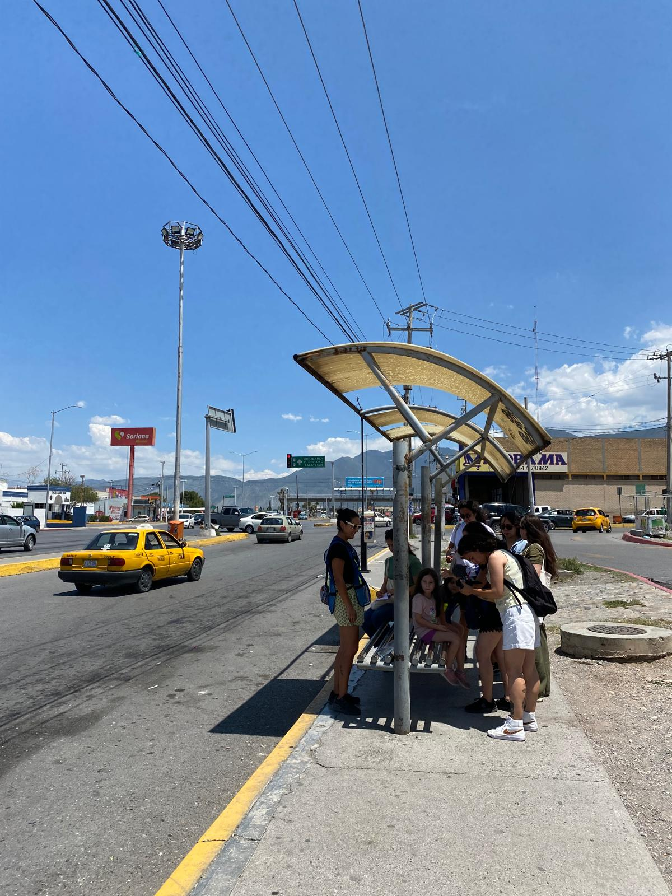

## Diana Infante-Vargas (she/her)

[Home](index.md)  |  [About me](aboutme.md)  |   [Research](researchpapers.md)  |   [Police Box Hunt](policeboxes.md)   |    [Contact](contactinfo.md)

I am currently a PhD candidate at the Interdisciplinary Global Development Centre at the University of York. My work focuses on public transportation in Saltillo through a gender perspective. My research interests include **the intersection of care work and mobility**, as well as **sustainable active travel and public policy research for walkable cities**. My work is funded by the University of York and Mexico's National Commission for Science and Technology. 

My latest research project applies a mixed-method approach to urban audits and identifies infrastructure gaps and how these relate to women's perceptions of vulnerability and safety. I am passionate about exploring cities by walking and cycling, and I advocate for walkable communities through my activism. I am particularly interested in women's right to the city and how policy can improve their urban experiences.

I earned my bachelor’s degree in Architecture from Tecnológico de Monterrey in Mexico and completed my MSc. in International Planning and Urban Design at Cardiff University. I am a Chevening Scholar (2019-2020) and have received other multiple scholarships and awards that have allowed me to access higher education.
I am passionate about **exploring creative and collaborative outlets** when it comes to researching and envisioning **gender-conscious cities**. My work has been published in journals like Environment and Planning C: Politics and Space; Gender, Place, and Culture; and the Journal of Gender Studies and you can access my work on the tab [research papers.](researchpapers.md)

¿Quieres leerme en español? Colaboro como columnista invitada en la rueda creativa de [Ruedas Rebeldes](https://www.ruedasrebeldes.com/rueda-creativa/) y puedes leer mi sección *Historias Banqueteras.* 🚲

